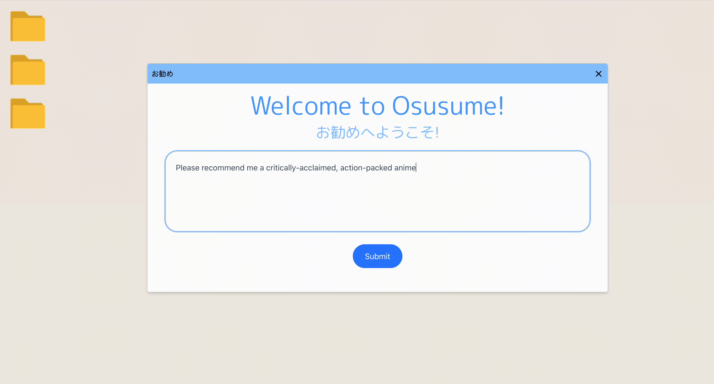
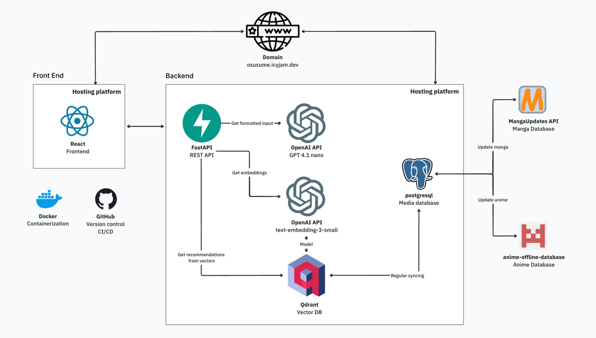

# osusume

Osusume is an LLM-based recommender app to help you find the anime or manga you're in the mood for!



Instead of user- or tag-based recommendations, Osusume directly uses your prompt to find media that match what you
wrote.

## State of the project

Osusume is currently a prototype! It was started as a learning project for LLM and RAG applications, as well as
technologies like Docker, Qdrant, FastAPI and React. The documentation, application UI, and recommender logic can still
be improved. However, all the pieces are already there, ready to be built upon in future iterations.

## Project architecture

The following diagram (made with [tldraw](tldraw.com)) illustrates the global architecture of the app. It is a little
more advanced than we are, considering we have not hosted the project anywhere yet, and the regular database updates
have yet to be implemented.


## Recommender pipeline

Under the hood, the recommender functions as follows:

1. The user query is processed by an LLM to extract an enriched description, keywords, and hard constraints (type of
   media, score and date ranges, release status)
2. The processed query is embedded as a vector, and compared against existing media contained in the database
3. The closests vectors are reranked and returned
4. The corresponding IDs for the selected vectors are retrieved in the SQL media database
5. The recommendations are returned by the API and displayed on the front end

## Project Structure

```
.
├── backend/                  # Core backend logic
│   ├── app/                  # Main application modules
│   │   ├── api/              # REST API endpoints and models
│   │   ├── clients/          # External service clients (LLMs)
│   │   ├── db/               # Database models and access utilities
│   │   ├── ingestion/        # Data ingestion and preprocessing
│   │   ├── recommender/      # Recommender system algorithms
│   │   ├── services/         # Internal services and business logic
│   │   └── vector_db/        # Vector database integration
│   │
│   ├── cli/                  # Command-line interface tools
│   │   ├── ingestion/        # CLI commands for data ingestion
│   │   ├── vector_db/        # CLI commands for vector DB management
│   │   └── main.py           # Entry point for CLI
│   │
│   ├── common/               # Shared utilities and configuration
│   │   ├── config/           # Config files and defaults
│   │   └── env.py            # Environment variable handling
│   │
│   ├── test/                 # Unit and integration tests
│   └── main.py               # Backend entry point
│
├── frontend/                 # Frontend code
│
└── notebooks/                # Prototyping, analysis, and experimentation
```

## Requirements

To run this project, you will need Docker and Docker Compose installed on your machine. Installation guides for Docker
can be found [here](https://docs.docker.com/get-docker/) and for Docker
Compose [here](https://docs.docker.com/compose/install/).

## Running the Application

You can run the application using docker:

   ```bash
   docker-compose up --build
   ```

This command builds the images for the frontend and backend if they don't exist and starts the containers. The
backend is available at `http://localhost:8000/` and the frontend at `http://localhost:3000/`.

Refer to [.env-template](backend/.env-template) for a list of the necessary environment variables. You will also have to
use the [CLI](backend/cli) inside the container if you want to download the databases.

Proper documentation is on our to-do list. In the meantime, feel free to get in touch if you want to run the project!

## Contributing

Contributions to this project are welcome. Please fork the repository and submit a pull request, or get in touch via the
Discussions tab!

## Credits

The GitHub project was initially built
from [this template](https://github.com/chigwell/plain-fastapi-react-docker/tree/main).

## License

This project is licensed under the MIT License - see the `LICENSE` file for details.
